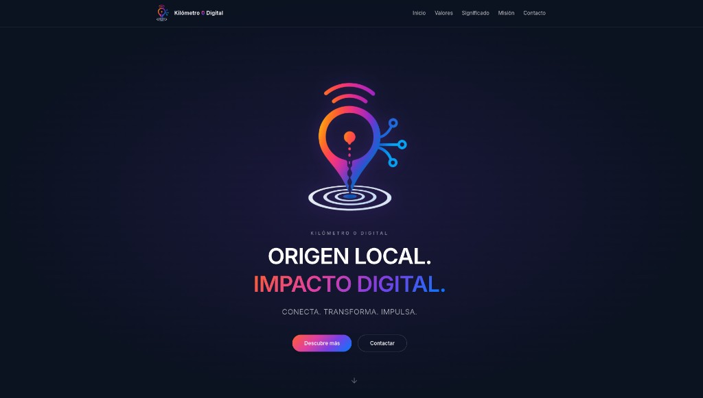

# KM0 - Web

Public marketing landing for **KM0 Digital**.

**Production:** Spanish (default) [https://km0digital.com](https://km0digital.com) · Catalan [/ca/](https://km0digital.com/ca/) · English [/en/](https://km0digital.com/en/) · Blog [/doc/](https://km0digital.com/doc/)



## About

KM0 connects people, ideas, and opportunities from the point of origin. This repository is the public marketing site with informational sections, brand identity (orange → magenta → purple → blue gradient), and smooth scroll animations.

Translations live in **`src/i18n/{es,ca,en}.json`**; default language is Spanish at `/`.

**Core message:** *ORIGEN LOCAL. IMPACTO DIGITAL.* - *CONECTA. TRANSFORMA. IMPULSA.*

(Project docs and this README are mainly in English; on-site wording follows each locale.)

## Version

RELEASE version lives in **`VERSION`** (semver, one line). When you bump releases, keep it in sync with **`package.json`** `version`.

## Locales

| Language | Path |
|---------|------|
| Spanish (default) | `/` |
| Catalan | `/ca/` |
| English | `/en/` |

| Blog (doc) | `/doc/` · `/ca/doc/` · `/en/doc/` |

Edit **`src/i18n/es.json`**, **`ca.json`**, and **`en.json`** together so keys stay aligned.

### Blog / doc

Markdown posts live in **`src/content/doc/{es,ca,en}/`**. Collection schema: **`src/content.config.ts`**. Index and post pages use **`src/views/DocIndex.astro`** and **`DocPost.astro`**.

To add a post: create e.g. `src/content/doc/es/my-post.md` with frontmatter (`title`, `description`, `pubDate`, `locale`) and mirror in `ca/` and `en/` if localized. Rebuild to publish.

## Stack

| Layer | Technology |
|-------|------------|
| Frontend | [Astro](https://astro.build) 5 + [Tailwind CSS](https://tailwindcss.com) |
| Build | Node 22 (multi-stage Docker) |
| Static server | nginx (Alpine) in container |
| Production | Docker Compose → `127.0.0.1:9180` behind host Nginx (TLS) |

## Repository layout

```
├── src/
│   ├── i18n/           # Translation JSON + helpers
│   ├── components/
│   ├── layouts/
│   ├── content/doc/    # Blog markdown (per locale)
│   ├── pages/          # Landing + /doc/ routes
│   ├── views/          # Landing, DocIndex, DocPost
│   ├── scripts/
│   └── styles/
├── public/brand/       # logo.png, brand-guide.png
├── docs/
│   ├── brand-tokens.md
│   ├── runbook.md      # server operations
│   └── preview-hero.png
├── nginx/              # container config + host vhost template
├── Dockerfile
└── docker-compose.yml
```

## Quick start

### Docker (recommended)

```bash
git clone git@github.com:AMVARA-CONSULTING/km0-web.git
cd km0-web
docker compose build
docker compose up -d
curl -sI http://127.0.0.1:9180/
```

### Local development (Node on host)

Use **`npm ci`** (not `npm install`) so installs match the committed **`package-lock.json`** exactly, including transitive dependencies.

```bash
npm ci
npm run dev      # http://localhost:4321
npm run build    # output in dist/
```

### Dependencies

Direct dependencies in **`package.json`** are pinned to exact versions (no `^` or `~`). Transitive dependencies are pinned in **`package-lock.json`** with integrity hashes. **`.npmrc`** sets `save-exact=true` for any new direct dependency.

| Action | Command |
|--------|---------|
| Install (local or CI) | `npm ci` |
| Docker build | `npm ci` in `Dockerfile` (already configured) |
| Add a direct dependency | `npm install package@x.y.z` (exact pin enforced) |
| Bump after editing `package.json` | `npm install --package-lock-only`, commit both files, rebuild image |

Do not run bare `npm update` or `npm install` without a deliberate version bump; that can rewrite the lockfile.

## Editing content

| Change | Location |
|--------|----------|
| Translate text | **`src/i18n/es.json`**, **`ca.json`**, **`en.json`** |
| Sections / markup | **`src/views/Landing.astro`** and **`src/components/*.astro`** |
| Colors and brand | `docs/brand-tokens.md`, `src/styles/tokens.css`, `tailwind.config.mjs` |
| Logo and images | `public/brand/` |
| Domain / SEO | `astro.config.mjs` (`site`) |

After changes on the server:

```bash
docker compose build && docker compose up -d
```

## Server deployment

The host reverse proxy terminates TLS and proxies to `127.0.0.1:9180`. Nginx template: `nginx/sites-available/km0`.

Full operations guide: **[docs/runbook.md](docs/runbook.md)** (TLS, ports, troubleshooting, coexistence with OpenCloud at **`cloud.km0digital.com`**).

Contributing and text style (no em dash U+2014): **[CONTRIBUTING.md](CONTRIBUTING.md)**.

## Architecture

```
Internet → Nginx (km0digital.com:443) → 127.0.0.1:9180 (km0-web container)
```

OpenCloud (file storage) runs at **[https://cloud.km0digital.com](https://cloud.km0digital.com)** - separate hostname from this marketing site.

## License

Private project - © KM0 Digital.
