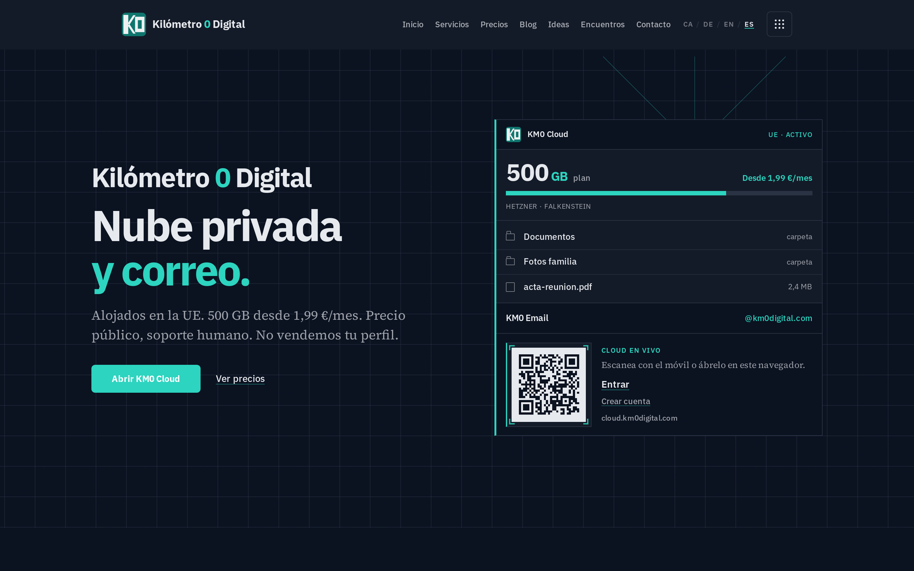

# KM0 - Web

Public marketing landing for **KM0 Digital**.

**Production:** Spanish (default) [https://km0digital.com](https://km0digital.com) · Catalan [/ca/](https://km0digital.com/ca/) · English [/en/](https://km0digital.com/en/) · German [/de/](https://km0digital.com/de/) · Blog [/doc/](https://km0digital.com/doc/)



## About

KM0 connects people, ideas, and opportunities from the point of origin. This repository is the public marketing site: **cool civic editorial**, dark-only (Ink on Paper navy, Signal teal accent, IBM Plex Sans + Source Serif 4). Brand contract: `docs/brand-tokens.md`. Agent doctrine: `docs/design/anti-slop-doctrine.md`.

**Privacy:** km0digital is built with a privacy-first mindset. We do not sell user data, build advertising profiles, or monetise files. See the landing page privacy section and `/legal/` for the full policy.

**SEO:** `public/robots.txt`, `@astrojs/sitemap` (`/sitemap-index.xml`), canonical URLs, and `km0digital` in page metadata. Operators should submit the sitemap in Google Search Console and Bing Webmaster Tools (see `docs/runbook.md`).

Translations live in **`src/i18n/{es,ca,en,de}.json`**; default language is Spanish at `/`.

**Core message:** *ORIGEN LOCAL. IMPACTO DIGITAL.* - *CONECTA. TRANSFORMA. IMPULSA.*

(Project docs and this README are mainly in English; on-site wording follows each locale.)

## Design system

Locked remodel direction (phases 1–3, paint, craft parity). Do not reintroduce light themes, purple gradients, zebra section bands, or generic SaaS hero recipes.

| Topic | Doc |
|-------|-----|
| Tokens (colors, type, motion, surfaces) | `docs/brand-tokens.md` · runtime `src/styles/tokens.css` |
| Anti-slop doctrine (hard bans + craft locks) | `docs/design/anti-slop-doctrine.md` |
| Remodel epic order and product locks | `docs/design/remodel-epic.md` |
| Stirling paint (surfaces, motion, chrome) | `docs/design/stirling-paint-phase.md` |
| Craft parity Hard gate (Stirling / Satisfecho) | `docs/design/craft-parity-phase.md` |
| Hallmark adaptations (P/H/E/S/R/V) | `docs/design/hallmark-adaptations.md` |
| IA map | `docs/design/ia-map.md` |
| Agent skills | `.cursor/skills/km0-anti-slop-design/` · `.cursor/skills/km0-web-copy/` |

**Visual locks (summary):** dark Paper canvas only; opt-in `.surface-snow` / `.surface-ink` / `.surface-band` (no `nth-child` zebra); Origin stamp mark + `.km0-motif` atmosphere; first viewport = brand + one headline + one support + one CTA group + live product proof; motion capped to reveals, masthead compact, Offer sticky pin, hero capacity meter.

## Version

Footer semver comes from **`package.json`** `version` (via `src/lib/site-version.ts`). Autoagents coders run **`./scripts/bump-patch-version.sh`** once per product task that ships site files. Keep root **`VERSION`** aligned when cutting a release tag.

## Locales

| Language | Path |
|---------|------|
| Spanish (default) | `/` |
| Catalan | `/ca/` |
| English | `/en/` |
| German | `/de/` |

| Blog (doc) | `/doc/` · `/ca/doc/` · `/en/doc/` · `/de/doc/` |

Edit **`src/i18n/es.json`**, **`ca.json`**, **`en.json`**, and **`de.json`** together so keys stay aligned.

### Blog / doc

Markdown posts live in **`src/content/doc/{es,ca,en,de}/`**. Collection schema: **`src/content.config.ts`**. Index and post pages use **`src/views/DocIndex.astro`** and **`DocPost.astro`**.

To add a post: create e.g. `src/content/doc/es/my-post.md` with frontmatter (`title`, `description`, `pubDate`, `locale`) and mirror in `ca/`, `en/`, and `de/` if localized. Rebuild to publish.

## Stack

| Layer | Technology |
|-------|------------|
| Frontend | [Astro](https://astro.build) 5 + [Tailwind CSS](https://tailwindcss.com) |
| Build | Node 22 (multi-stage Docker) |
| Static server | nginx (Alpine) in container |
| Production | Docker Compose → `127.0.0.1:9180` behind host Nginx (TLS) |

## Repository layout

```
├── src/
│   ├── i18n/           # Translation JSON + helpers (es/ca/en/de)
│   ├── components/
│   ├── layouts/
│   ├── content/doc/    # Blog markdown (per locale)
│   ├── pages/          # Landing + /doc/ routes
│   ├── views/          # Landing, DocIndex, DocPost
│   ├── scripts/
│   └── styles/         # tokens.css (civic dark)
├── public/brand/       # logo, OG, QR, mark assets
├── docs/
│   ├── brand-tokens.md
│   ├── design/         # doctrine, paint, craft, IA, studies
│   ├── runbook.md      # server operations
│   └── preview-hero.png
├── nginx/              # container config + host vhost template
├── Dockerfile
└── docker-compose.yml
```

## Quick start

### Docker (recommended)

```bash
git clone git@github.com:AMVARA-CONSULTING/km0-web.git
cd km0-web
docker compose build
docker compose up -d
curl -sI http://127.0.0.1:9180/
```

### Local development (Node on host)

Use **`npm ci`** (not `npm install`) so installs match the committed **`package-lock.json`** exactly, including transitive dependencies.

```bash
npm ci
npm run dev      # http://localhost:4321
npm run build    # output in dist/
```

### Dependencies

Direct dependencies in **`package.json`** are pinned to exact versions (no `^` or `~`). Transitive dependencies are pinned in **`package-lock.json`** with integrity hashes. **`.npmrc`** sets `save-exact=true` for any new direct dependency.

| Action | Command |
|--------|---------|
| Install (local or CI) | `npm ci` |
| Docker build | `npm ci` in `Dockerfile` (already configured) |
| Add a direct dependency | `npm install package@x.y.z` (exact pin enforced) |
| Bump after editing `package.json` | `npm install --package-lock-only`, commit both files, rebuild image |

Do not run bare `npm update` or `npm install` without a deliberate version bump; that can rewrite the lockfile.

## Editing content

| Change | Location |
|--------|----------|
| Translate text | **`src/i18n/es.json`**, **`ca.json`**, **`en.json`**, **`de.json`** |
| Sections / markup | **`src/views/Landing.astro`** and **`src/components/*.astro`** |
| Colors and brand | `docs/brand-tokens.md`, `src/styles/tokens.css`, `tailwind.config.mjs` |
| Design doctrine / remodel | `docs/design/anti-slop-doctrine.md`, `docs/design/remodel-epic.md` |
| Paint / craft parity | `docs/design/stirling-paint-phase.md`, `docs/design/craft-parity-phase.md` |
| Logo and images | `public/brand/` |
| Domain / SEO | `astro.config.mjs` (`site`) |

After changes on the server:

```bash
docker compose build && docker compose up -d
```

## Server deployment

The host reverse proxy terminates TLS and proxies to `127.0.0.1:9180`. Nginx template: `nginx/sites-available/km0`.

Full operations guide: **[docs/runbook.md](docs/runbook.md)** (TLS, ports, troubleshooting, coexistence with OpenCloud at **`cloud.km0digital.com`**).

Contributing and text style (no em dash U+2014): **[CONTRIBUTING.md](CONTRIBUTING.md)**. Agent loop: **[docs/agent-loop.md](docs/agent-loop.md)**.

## Architecture

```
Internet → Nginx (km0digital.com:443) → 127.0.0.1:9180 (km0-web container)
```

OpenCloud (file storage) runs at **[https://cloud.km0digital.com](https://cloud.km0digital.com)** - separate hostname from this marketing site.

## License

Private project - © KM0 Digital.
